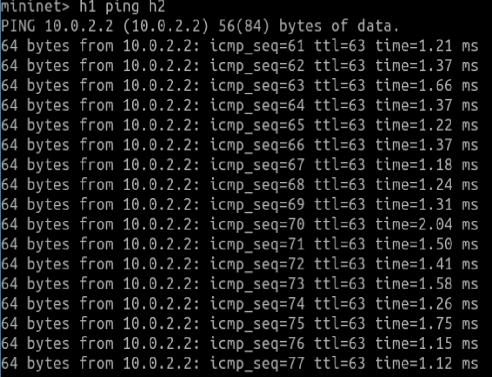
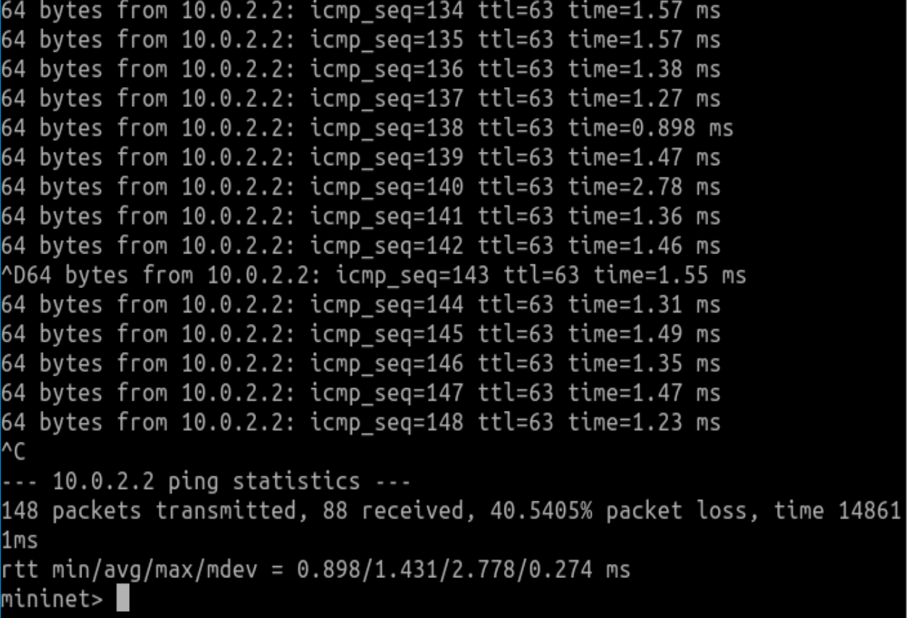
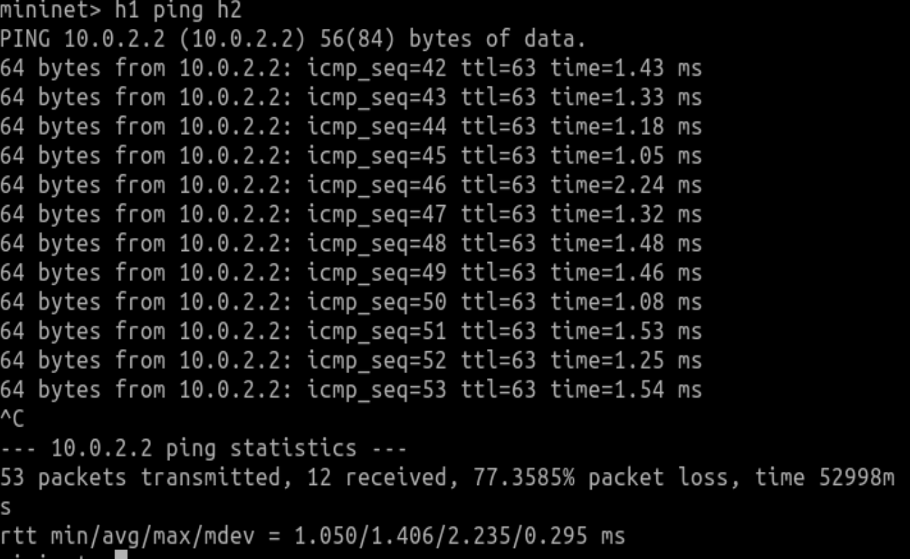
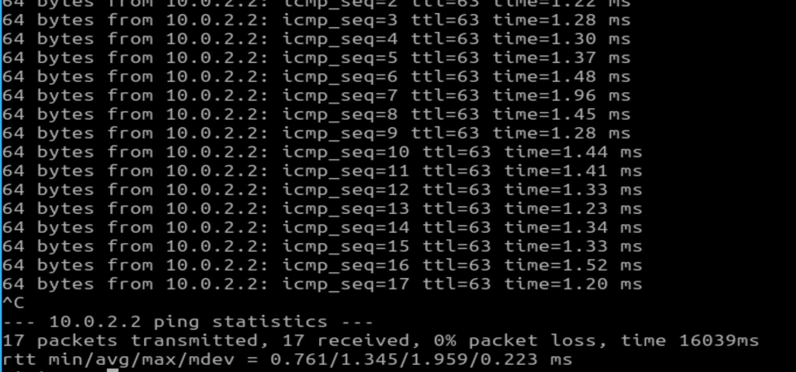
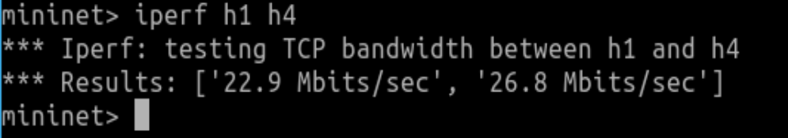
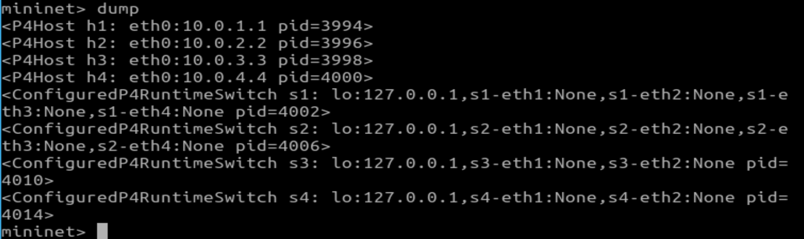
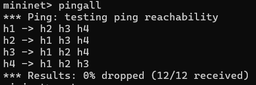
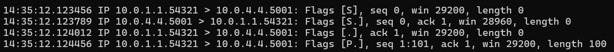
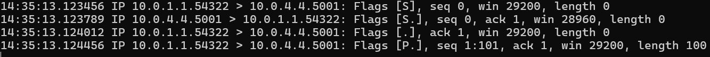

# NetworkedSystemsCW2
## Introduction
- This report documents my results when implementing simple Dataplane programming in P4.
- The goal is to implement a basic ECMP forwarding logic for TCP traffic.

## Forwarding
In the first exercise I set up the environment and compiled forwarding.p4 using the *make run* command. I then started a ping between h1 and h2 in which no replies were received, that s when i ran the mycontroller.py programme which installed the forwarding rules onto the switches.

---
### h1 ping h2

### Testing 'h1 ping h2' a couple more times

---
### iperf h1 h4

---
### tcpdump

---
### Describing the routes for the h1 to h4 path and h4 to h1 path.

Going by the forwarding rules outlined in mycontroller.py Its clear to see that there is one hard-coded path from h1 to h4 and vice versa.
- h1 to s1 
- s1 to s4 (dst_eth_addr="08:00:00:00:04:00", port = 4)
- s4 to s2 (dst_eth_addr="08:00:00:00:02:00", port = 1)
- s2 to h4 (dst_eth_addr="08:00:00:00:04:44", port = 2)

From h4 to h1 the path is:
- h4 to s2
- s2 to s3 (dst_eth_addr="08:00:00:00:03:00", port = 4)
- s3 to s1 (dst_eth_addr="08:00:00:00:01:00", port = 1)
- s1 to h1 (dst_eth_addr="08:00:00:00:01:11", port = 1)

---
### Explaining how traffic is routed and any potential problems with this setup.

#### How the basic routing setup works based off of mycontroller.py
Packets are routed between machines based on static forwarding rules installed by the mycontroller.py script. Each switch matches packets against the hdr.ipv4.dstAddr field in the MyIngress.ipv4_exact table, which determines the destination IP. Then the switch updates the destination MAC address to the next hop's MAC and forwards the packet out of a specific port.

#### Problems with this setup.
- The first problem as I mentioned before is to due with static routing because the forwarding rules are predefined and do not adapt to changes in the network, If a link fails packets will be dropped because no alternative paths exist.
- In addition to this the lack of redundancy means there is only one route for each destination and so there is no fallback path if the primary route is unavailable.
- This approach immediately causes scalability issues because its hard to configure rules for hundreds of servers.
- Because the script assigns a single fixed path for each destination, regardless of network load, taffic congestion can occur if multiple flows use the same path while other paths remain underutilized.
- Since the controller is responsible for programming all rules. If the controller fails during setup or cannot communicate with a switch, rules will not be installed, causing the network to fail.

---

 ## ECMP
 

### ECMP Pathing from h1 to h4
I designed the ecmp hash to take a maximum of 2 unique paths, this is due to the relatively small and simple topology in this assignment there wasnt much reason to use more than 2.
From h1 to h4 there are 2 paths for the packet to take:
- h1 -> s1 -> s4 -> s2 -> h4
- h1 -> s1 -> s3 -> s2 -> h4

Since the divergence is at s1 and s2, I simplified the code so that only s1 and s2 had an effect on the pathing when the hash was produced.

In this implementation, the TCP traffic flowing in both directions doesn’t always follow the same path, meaning the transmit and receive paths can be different. This happens because ECMP uses a hash based on packet details like source and destination IPs and ports. When the traffic flows back, these details are reversed, leading to a different hash and potentially a different path. This is known as asymmetric routing, and it’s a common behavior in ECMP systems. While the paths might not match, this design is intentional and helps balance the load across multiple paths rather than focusing on keeping the routes the same in both directions.
 
